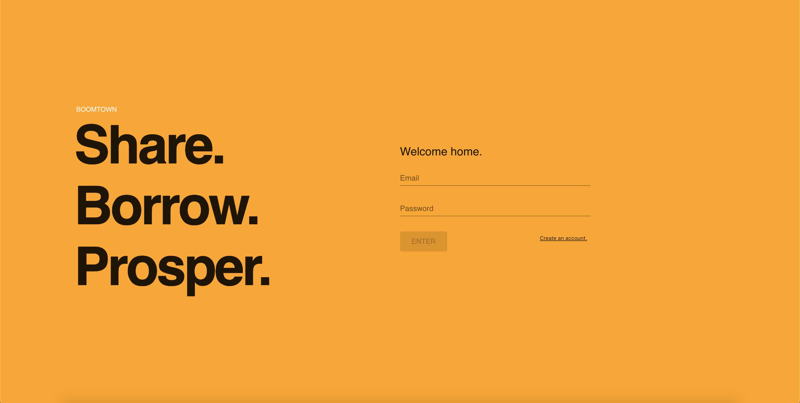

# Boomtown 🏙🏙🏙

## Description

Boomtown is a React/Redux app designed to bolster the idea of sharing within communities. Users are free to post items available for borrow, or borrow items themselves. Items are displayed in a modern masonry-style layout for hipster convenience.

## Screenshots




## Installation

Download the repo, then run:

```bash
cd client && npm install
```

## Start-up

run:

```bash
npm run dev
```

from inside the `server` directory, then the `client`.

## Built With

- Apollo Client
- Express
- GraphQL
- Postgres
- React
- Redux
